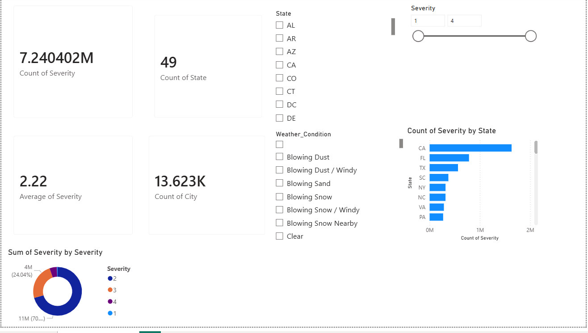

🚦 Smart Traffic Accident Hotspot Prediction & Severity Analysis System

📌 Project Overview

Traffic accidents remain a major public safety concern worldwide. This project uses Data Analytics, Machine Learning, and Data Visualization techniques to analyze accident patterns, identify accident-prone locations (hotspots), and predict accident severity using historical traffic accident data.

The project follows a complete end-to-end analytics workflow, starting from data understanding and exploratory analysis to machine learning model development, hotspot detection, and interactive dashboard creation.

⸻

🎯 Project Objectives
	•	Analyze large-scale traffic accident data.
	•	Identify accident hotspots and high-risk zones.
	•	Understand factors influencing accident severity.
	•	Build predictive machine learning models.
	•	Visualize accident trends using interactive dashboards.
	•	Generate actionable insights for improving road safety.

⸻

🛠️ Technologies Used

Programming & Data Analysis
	•	Python
	•	Pandas
	•	NumPy

Data Visualization
	•	Matplotlib
	•	Seaborn
	•	Folium
	•	Power BI

Machine Learning
	•	Scikit-Learn
	•	Random Forest Classifier
	•	XGBoost Classifier

Version Control
	•	Git
	•	GitHub

Smart-Traffic-Accident-Hotspot-Prediction-System
│
├── Dataset
│   └── dataset_info.md
│
├── Images
│   ├── dashboard_powerbi.png
│   ├── hotspot_heatmap.html
│   ├── high_risk_hotspot_heatmap.html
│   └── additional visualizations
│
├── Python
│   ├── Phase1_Data_Understanding.ipynb
│   ├── Phase2_EDA.ipynb
│   ├── Phase3_Feature_Engineering.ipynb
│   ├── Phase4_Machine_Learning.ipynb
│   ├── Phase5_XGBOOST_Model.ipynb
│   └── Phase6_Hotspot_Detection.ipynb
│
├── Reports
│   ├── Phase1_Insights.md
│   ├── Phase2_EDA_Insights.md
│   ├── Phase3_Feature_Engineering.md
│   ├── Phase4_Model_Results.md
│   ├── Phase5_XGBoost_Results.md
│   ├── Phase6_Hotspot_Analysis.md
│   └── Phase7_PowerBI_Dashboard_Report.md
│
├── README.md
└── requirements.txt

🔄 Project Workflow

Phase 1: Data Understanding
	•	Explored accident dataset structure.
	•	Studied dataset dimensions and features.
	•	Identified missing values and data quality issues.

Phase 2: Exploratory Data Analysis (EDA)
	•	State-wise accident analysis.
	•	Weather condition analysis.
	•	Visibility and temperature impact analysis.
	•	Hourly, daily, and monthly accident trend analysis.
	•	Correlation analysis of important features.

Phase 3: Feature Engineering
	•	Missing value handling.
	•	Feature selection and transformation.
	•	Creation of machine-learning-ready dataset.

Phase 4: Machine Learning

Implemented a Random Forest Classifier for accident severity prediction.

Evaluation Metrics:
	•	Accuracy
	•	Precision
	•	Recall
	•	F1 Score
	•	Confusion Matrix

Phase 5: Advanced Modeling

Implemented XGBoost Classifier and compared performance with Random Forest.

Phase 6: Hotspot Detection
	•	Identified accident-prone regions.
	•	Generated hotspot maps.
	•	Visualized high-risk zones using geospatial analysis.

Phase 7: Power BI Dashboard

Built an interactive dashboard to visualize:
	•	Accident Severity Distribution
	•	State-wise Accident Trends
	•	Monthly Accident Analysis
	•	Weather Impact on Accidents
	•	Accident Hotspot Insights
	•	Risk Zone Analysis

⸻

📈 Key Results

Machine Learning Performance
	•	Developed and evaluated Random Forest and XGBoost models.
	•	Achieved strong predictive performance for accident severity classification.
	•	XGBoost demonstrated improved performance over baseline models.

Accident Insights
	•	Peak accident occurrences were observed during specific hours of the day.
	•	Weather and visibility conditions significantly affected accident severity.
	•	Certain locations consistently exhibited higher accident frequencies.

Hotspot Detection
	•	Successfully identified accident-prone regions.
	•	Generated interactive hotspot maps for risk assessment and visualization.

⸻

📊 Visualizations Included

Exploratory Data Analysis
	•	State Analysis
	•	Weather Analysis
	•	Monthly Analysis
	•	Hourly Analysis
	•	Correlation Heatmap

Model Evaluation
	•	Random Forest Confusion Matrix
	•	XGBoost Confusion Matrix
	•	Feature Importance Analysis

Hotspot Detection
	•	Hotspot Heatmap
	•	High-Risk Zone Heatmap

Dashboard
	•	Interactive Power BI Dashboard

⸻

📚 Dataset Information

Dataset: US Accidents (2016–2023)

Due to GitHub storage limitations, the complete dataset is not included in this repository.

Dataset Source:

https://www.kaggle.com/datasets/sobhanmoosavi/us-accidents

⸻

🚀 Future Enhancements
	•	Real-time accident severity prediction.
	•	Deployment using Flask/FastAPI.
	•	Live traffic data integration.
	•	Advanced geospatial clustering techniques.
	•	Cloud deployment for dashboard access.
	•	Deep Learning-based accident prediction models.

⸻

👨‍💻 Author

Dheeraj Reddy

Aspiring Data Scientist | Data Analytics Enthusiast | Machine Learning Practitioner

Skills Demonstrated
	•	Data Cleaning
	•	Exploratory Data Analysis
	•	Feature Engineering
	•	Machine Learning
	•	XGBoost
	•	Data Visualization
	•	Power BI Dashboard Development
	•	Git & GitHub

⸻

⭐ Project Highlights

✅ End-to-End Data Analytics Project

✅ Machine Learning-Based Severity Prediction

✅ Accident Hotspot Detection

✅ Interactive Power BI Dashboard

✅ Real-World Large-Scale Dataset Analysis

✅ Complete Data Science Workflow

If you found this project useful, consider giving it a ⭐ on GitHub.

